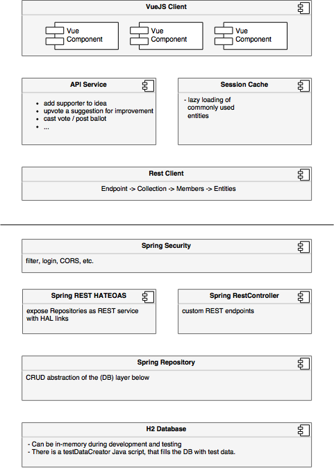

# liquido-vue-frontend

> Frontend for my liquid democracy app written with Vue 2.0

Liquido - a modern aproach for interactive, representative and direct democracy.

Liquid Democracy or Proxy Voting is a modern variant of direct demorcacy. Voters cast their votes for polls, just as you do it today. But a voter can also delegate his vote to a proxy. Then the proxy votes for him. A proxy may accumulate multiple delegated votes. This is what political parties do in today's democracy. But in Liquid Democracy, a voter may revoke his delegation at any time. A voter may simply decide to vote for himself per every poll. A voter may also decide to delegate his vote to another proxy at any time. Not just every four years.

# Liquido Architecture

See [liquido-backend-spring](https://github.com/Doogiemuc/liquido-backend-spring) for the backend implementation.

This is my playground for learning the client side Java script framework [Vue 2.0](https://vuejs.org). Meanwhile this grew to a medium sized "single page application" (SPA) with quite some nice features.

## Dependencies / Technical tools used

 * [Vue 2.0](http://vuejs.org/guide/) - Client side MVC JS lib (comparable to AngularJS but different :-)
 * [Vue-loader](http://vuejs.github.io/vue-loader) Load components from .vue files
 * [Vue-router](http://router.vuejs.org/) - URL navigation for single page applications
 * Based on the [Vue Webpack Boilerplate](https://github.com/vuejs-templates/webpack) project template
 * Of course see [package.json](https://github.com/Doogiemuc/liquido-vue-frontend/blob/master/package.json) for full details

## Features

 * HTML, JS and CSS is packed and bundeld with Webpack
 * Local client side caching in the SPA
 * Clean API client for REST full backend
 * A powerfull homebrew Vue Table component with filtering, sorting and pagination
 * Tests, tests and more tests.  I am a big fan of TDD!

## References

 * [Schulze voting method](http://en.wikipedia.org/wiki/Schulze_method) - the algorithm to select the winner of a poll
 * [OpaVote](https://www.opavote.com/) - yet another voting software

## Roadmap

### Feature Roadmap

 * Configuration: User may opt out to become a proxy. (Because his delegees would know how he voted.)

### Technical Roadmap

 * Built upon this boilerplate template: Has more recent versions, e.g. of webpack: https://github.com/jonashackt/spring-boot-vuejs/
 * Deploy production build to AWS EC2 instance with https://wiki.alpinelinux.org/wiki/Lighttpd  [done]
 * Automate this deployment
   * via Bash script?
   * Via AWS code deploy?

## Build Setup

- `npm run dev`: first-in-class development experience.
  - Webpack + `vue-loader` for single file Vue components.
  - State preserving hot-reload
  - State preserving compilation error overlay
  - Lint-on-save with ESLint
  - Source maps

- `npm run build`: Production ready build.
  - JavaScript minified with [UglifyJS](https://github.com/mishoo/UglifyJS2).
  - HTML minified with [html-minifier](https://github.com/kangax/html-minifier).
  - CSS across all components extracted into a single file and minified with [cssnano](https://github.com/ben-eb/cssnano).
  - All static assets compiled with version hashes for efficient long-term caching, and a production `index.html` is auto-generated with proper URLs to these generated assets.

- `npm run smoke`: Very fast smoke tests written with Jasmine.
  - No browser involed, but blazingly fast.

- `npm run unit`: Unit tests run in PhantomJS with [Karma](http://karma-runner.github.io/0.13/index.html) + [Mocha](http://mochajs.org/) + [karma-webpack](https://github.com/webpack/karma-webpack).
  - Supports ES2015 in test files.
  - Supports all webpack loaders.
  - Easy mock injection.

- `npm run e2e`: End-to-end tests that run against a given environment (e.g. PROD)

- `npm run e2e_dev`: End-to-end tests with [Nightwatch](http://nightwatchjs.org/) that start their own dev-server locally.
  - Run tests in multiple browsers in parallel.
  - Works with one command out of the box:
    - Selenium and chromedriver dependencies automatically handled.
    - Automatically spawns the Selenium server.
    - Automatically spawns a local dev-server that servers the frontend node app.

For detailed explanation on how things work, checkout the [guide](http://vuejs-templates.github.io/webpack/) and [docs for vue-loader](http://vuejs.github.io/vue-loader).

## History

 * 2018-09-17 12:24:31 +0200 - Merge branch 'master' of https://github.com/Doogiemuc/liquido-vue-frontend
 * 2018-09-17 12:17:18 +0200 - make auto login of user optional and configurable
 * 2018-09-17 06:53:49 +0200 - Login is WORKING
 * 2018-08-23 15:43:57 +0200 - added e2e tests against prod
 * 2018-08-17 12:26:10 +0200 - E2E Tests with a lot of logging
 * 2018-08-12 10:11:09 +0200 - Voting is working! With nice error checking.
 * 2018-08-05 00:17:14 +0200 - Working on casting a vote. WIP
 * 2018-07-21 08:10:11 +0200 - Added sequence diagram for casting a vote
 * 2018-06-24 20:56:14 +0200 - Nicely working version of polls and cast ballot
 * 2018-05-12 09:20:01 +0200 - Nicely working Proposal_Show, Poll_Show and Comments. Many Bugfixes in SupportButton, TableFitlers etc
 * 2018-04-22 22:48:30 +0200 - Working on Poll page and improving LawPanel
 * 2018-04-22 07:49:30 +0200 - Larger renaming. Working version of Poll_Show page.
 * 2018-04-17 16:16:25 +0200 - Started working on polls page
 * 2018-04-12 07:05:50 +0200 - working on ideaspage
 * 2018-04-10 18:05:02 +0200 - SupportButton now is a dynamic vue component.
 * 2018-04-10 16:10:47 +0200 - Filters now work. Full reload from server can be triggerd.
 * 2018-04-08 11:28:39 +0200 - Filters are now working with DoogieTable
 * 2018-04-06 15:46:03 +0200 - Working on table filtering
 * 2018-04-06 13:19:05 +0200 - Nice working vrsion of new table filters
 * 2018-04-05 07:15:28 +0200 - Working on DoogieFilterSelect
 * 2018-04-01 20:25:21 +0200 - Created first version of GUI for table filters
 * 2018-03-24 17:33:17 +0100 - new LiquidoApiClient is working nicely. Happy case works without erros in the log for the first time.
 * 2018-03-12 22:07:40 +0100 - Bugfix in ApiClients with non encoded URI
 * 2018-03-08 19:03:41 +0100 - Moved controllers to pages dir
 * 2018-03-06 12:29:22 +0100 - Merge branch 'master' of https://github.com/Doogiemuc/liquido-vue-frontend
 * 2018-03-06 12:28:53 +0100 - added new screenshots
 * 2018-03-04 22:14:16 +0100 - Bugfix in sorting of DoogieTable
 * 2018-02-28 23:18:23 +0100 - Working on IdeasProposalApiClient and pretty nice bugfix in cachingInterceptor
 * 2018-02-25 11:14:44 +0100 - Very nice nav pills
 * 2018-02-10 00:07:53 +0100 - Bugfix in DoogieTable. Sorting now works together with editing
 * 2018-02-04 22:44:30 +0100 - minor updates
 * 2017-10-09 14:20:17 +0200 - Nice working version. Addes local cache for URLs.
 * 2017-07-24 09:40:44 +0200 - Nice working version for local developlment. Even offline.
 * 2017-04-02 22:08:44 +0200 - Introducing PollModel in frontend
 * 2017-02-28 15:59:19 +0100 - UI for a poll is working. Phui that was a CSS nightmare.
 * 2017-02-26 15:18:45 +0100 - Small design updates
 * 2017-02-26 15:03:28 +0100 - Supporting an idea works.
 * 2017-02-24 12:58:31 +0100 - nice working version. Improved UserHome. A lot of work on LiquidoAPIClient
 * 2017-02-10 15:52:06 +0100 - UserHome works again with a list of proposals and ideas
 * 2017-02-09 20:22:02 +0100 - Cleaned up main App startup. Is now much faster
 * 2017-02-08 18:19:29 +0100 - Working on Create and edit Idea page. Added PageNotFound.vue and logRequestInterceptor.js  Removed old *Service.js classes that have been replaced by LiquidoApiClient.js
 * 2017-02-06 22:46:53 +0100 - added to gitignore
 * 2017-02-06 22:45:53 +0100 - Edit idea page is working again. Replaced vue-form with vuelidate.
 * 2017-02-04 19:35:03 +0100 - Ideas page works with new LiquidoApiClient
 * 2017-01-30 14:34:16 +0100 - Working version after Vue2.0 update. Also updated many package and build dependencies
 * 2017-01-26 10:08:20 +0100 - New RestClient with Tests
 * 2017-01-19 11:50:55 +0100 - Upgraded to VueJS 2.0 - Work in progress ...
 * 2017-01-17 08:16:11 +0100 - Added architecture drawing
 * 2017-01-13 22:07:34 +0100 - HTTP Basic Auth Login is working
 * 2017-01-13 14:05:28 +0100 - Added Law and IdeaPanel. Working on LoginPage
 * 2017-01-08 15:19:39 +0100 - Addes new lightweight RestClient that works better with HATEOAS backend
 * 2016-12-18 20:15:19 +0000 - Create new idea now with confirmation. GREEN TESTS
 * 2016-12-15 14:47:04 +0000 - TinyMce now with placeholder text and live update of content via event
 * 2016-12-14 21:44:46 +0000 - WORKING TinyMceComponent.vue
 * 2016-12-14 16:51:51 +0000 - Working on Add Idea - with TinyMCE
 * 2016-11-28 21:34:50 +0100 - Saving a proxy now works. With green smoke tests.
 * 2016-11-27 20:09:25 +0000 - Cleaned up logging
 * 2016-11-27 12:54:48 +0000 - Very nice working version  * Added LiquidoCache.js for application specific caching.  * runJasmineTestsWithNode.js now automatically starts the mock backend server.  * improved logging
 * 2016-11-23 14:37:47 +0000 - ProxyEdit is now working with cached data
 * 2016-11-23 09:00:13 +0000 - Working on RootApp.vue and added test case for it
 * 2016-11-20 22:20:54 +0000 - First working version of SessionCache.js
 * 2016-11-20 20:16:15 +0000 - Editing proxy - two page version
 * 2016-11-17 19:42:00 +0000 - Working on Your Proxies page
 * 2016-10-14 12:42:35 +0000 - committed merge
 * 2016-10-14 12:42:02 +0000 - merged
 * 2016-10-14 12:29:37 +0000 - Large update. HEyvy work on Delegation service. Added mock backend. All tests are green!
 * 2016-10-03 23:35:52 +0200 - getNumVotes works with local backend server
 * 2016-10-03 20:47:44 +0000 - started working on getNumVotes from server
 * 2016-08-16 21:56:45 +0000 - Green smoke tests with much better logging
 * 2016-08-16 09:51:52 +0000 - Brandnew testDataCreator. Now also allows refs in query
 * 2016-08-11 19:35:54 +0000 - BaseRestClient is now a real singleton
 * 2016-08-08 19:39:48 +0000 - GREEN TESTS for BaseRestWebservice, now with JSONschmea validation
 * 2016-08-04 15:36:19 +0000 - added smoke tests with jasmine
 * 2016-08-03 09:17:14 +0000 - Working tests for population
 * 2016-08-02 20:03:26 +0000 - Tests for IdeaService and BaseRestService are green
 * 2016-07-31 22:23:02 +0000 - WORKING User and Idea Service. Highly optimized! With cache.
 * 2016-07-28 22:11:07 +0000 - Started working on UserService.js
 * 2016-07-26 12:14:31 +0000 - Working E2E Test for DoogieTable filtering
 * 2016-07-26 07:58:45 +0000 - Working on nightwatch.js E2E tests
 * 2016-07-26 07:55:22 +0000 - Working on nightwatch.js E2E tests
 * 2016-07-26 07:23:18 +0000 - Got testcases running with vue-resource interceptor
 * 2016-07-25 19:50:11 +0000 - Unit tests for DoogieTable are up and running. $> npm run unit
 * 2016-07-24 20:57:18 +0000 - a lot of work on DoogieTable. Now comes with first unit tests.
 * 2016-07-21 11:21:30 +0000 - DoogieTable is working with pager
 * 2016-07-18 19:27:56 +0000 - Working version of DoogieDataTable. With paging!
 * 2016-07-18 06:30:04 +0200 - Working on Proxies page and rowIndex of editable table
 * 2016-07-15 21:06:33 +0200 - Got testDataCreator back up working, with
 * 2016-07-14 23:51:01 +0200 - Working version of edit with vue-resource
 * 2016-07-14 23:05:13 +0200 - Working version with edit and update to DB
 * 2016-07-12 18:14:06 +0000 - working version of listIdeas
 * 2016-07-12 07:46:24 +0000 - EditableCell in vue-tables with loading spinner
 * 2016-07-03 21:21:20 +0000 - First nice working version of TestDataCreator
 * 2016-06-20 21:12:40 +0200 - Initial commit

`git log --pretty=format:" * %ci - %s"`
